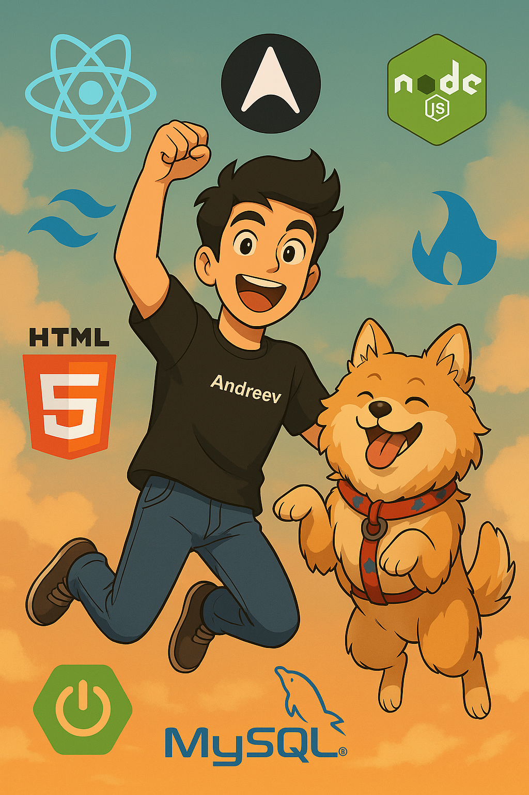
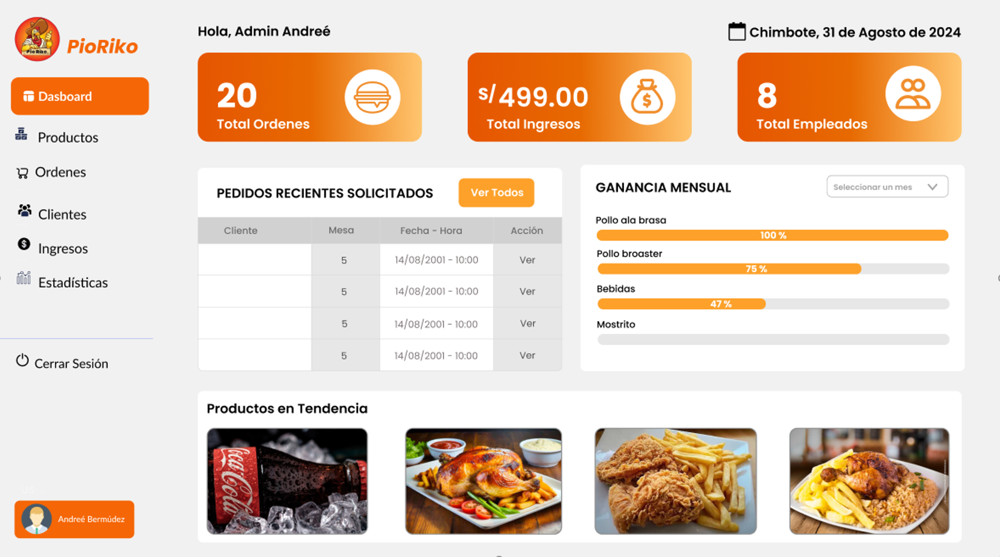

  <!-- Banner anime -->
  

  <h1>👋 Hola, soy Andree Bermudez</h1>
  
💻 Desarrollador Full Stack | En constante aprendizaje | Apasionado por crear soluciones modernas

---

## 🚀 Tecnologías que manejo

### 🧩 Frontend

  
  
  
  
  
  

### ⚙️ Backend

  
  
  
  

---

## 📘 En aprendizaje

  
  
  
  

---

## 🚀 Proyectos destacados

  <h3>🛡️ Panel de Licencias</h3>
  
Sistema moderno de licencias con dashboard de administración

  
<strong>Stack:</strong> React + Zustand + TanStack + Axios + TailwindCSS + Spring Boot

  🔗 <a href="#">Repositorio</a>
  

  <h3>🌐 Municipalidad de Nuevo Chimbote</h3>
  
Página web oficial y panel de administración para una entidad pública

  
<strong>Stack:</strong> React + TailwindCSS + Axios + Spring Boot

  🔗 <a href="#">Repositorio</a>
  

  <h3>🎉 Hackatón Xperience - UTP</h3>
  
Proyecto desarrollado en hackatón universitaria usando API de Gemini

  
<strong>Stack:</strong> React + Gemini API

  🔗 <a href="#">Repositorio</a>
  

  <h3>☕ Blog de Café</h3>
  
Blog estático optimizado con Astro y WordPress Headless CMS

  
<strong>Stack:</strong> Astro + WordPress Headless

  🔗 <a href="#">Repositorio</a>
  

  <h3>👁️‍🗨️ Proyecto OcuLink (Innovación)</h3>
  
App experimental que simula movimientos oculares con Gemini + React

  
<strong>Stack:</strong> React + Gemini API + Node.js

  🔗 <a href="#">Repositorio</a>
  

  <h3>🚌 Proyecto Vía Costa</h3>
  
Sistema de gestión para viajes en bus

  
<strong>Stack:</strong> JavaFX + Spring Boot

  🔗 <a href="#">Repositorio</a>
  

  <h3>🍽️ Web de Restaurante Pío Riko</h3>
  
Página web para restaurante con administración y pedidos

  
<strong>Stack:</strong> React + Spring Boot

  🔗 <a href="#">Repositorio</a>
  

---

## 📫 Contacto

  📧 <strong>andreebermudez1408@gmail.com</strong> 
  🌐 <a href="https://www.linkedin.com/in/andree-berm%C3%BAdez-porras-1b0954328/">LinkedIn</a>

