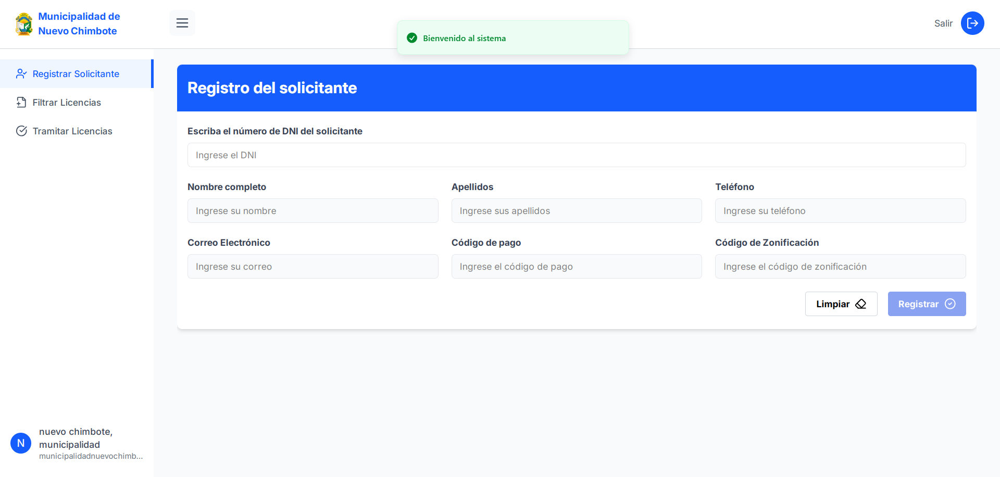
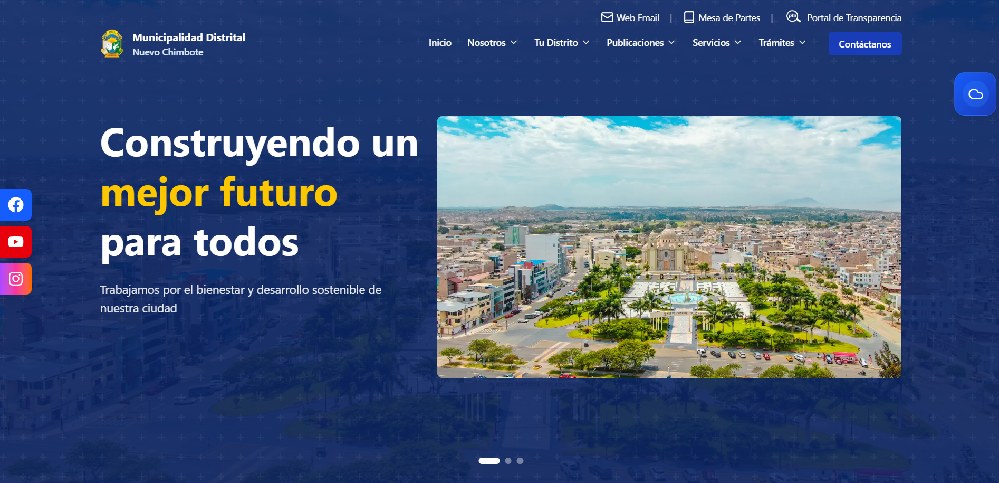
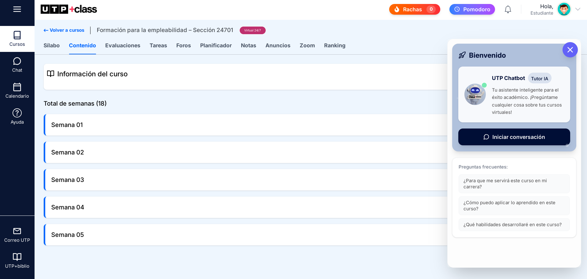
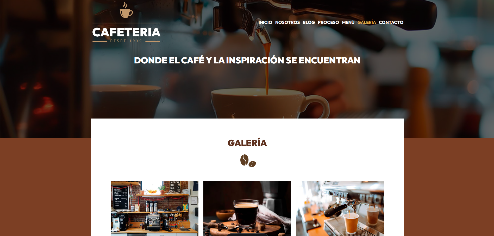
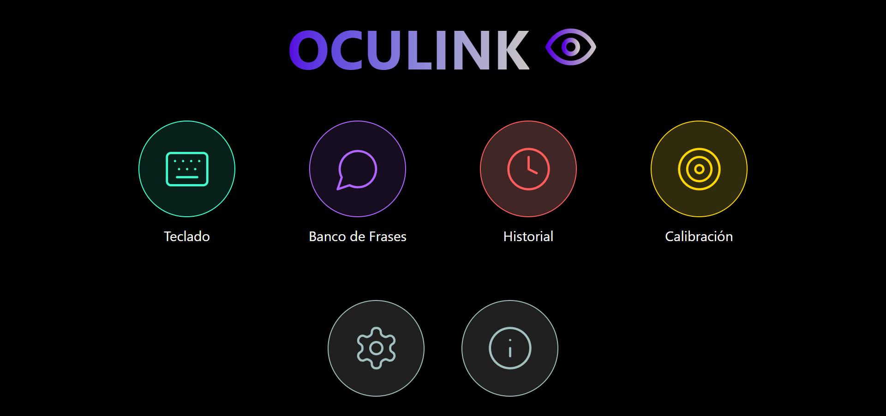
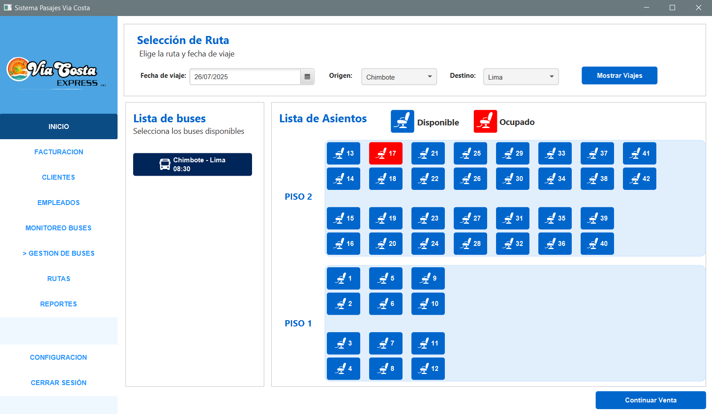
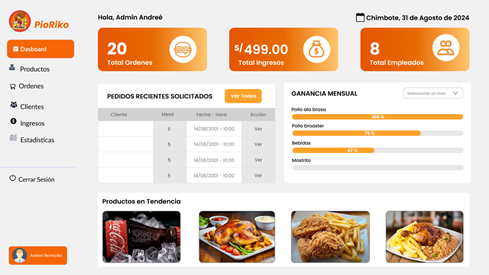

<h1 align="center">Hola, soy Andree Bermudez 👋</h1>

💻 Desarrollador Full Stack | En constante aprendizaje | Apasionado por crear soluciones modernas

---

## 🚀 Tecnologías que manejo

### 🧩 Frontend

  
  
  
  
  
  

### ⚙️ Backend

  
  
  
  

---

## 📘 En aprendizaje

  
  
  
  

---

## 🧠 Proyectos destacados

### 🛡️ Panel de Licencias
> Sistema moderno de licencias con dashboard de administración  
**Stack:** React + Zustand + TanStack + Axios + TailwindCSS + Spring Boot  
🔗 [Repositorio](#)  

---

### 🌐 Municipalidad de Nuevo Chimbote
> Página web oficial y panel de administración para una entidad pública  
**Stack:** React + TailwindCSS + Axios + Spring Boot  
🔗 [Repositorio](#)  

---

### 🎉 Hackatón Xperience - UTP
> Proyecto desarrollado en hackatón universitaria usando API de Gemini  
**Stack:** React + Gemini API  
🔗 [Repositorio](#)  

---

### ☕ Blog de Café
> Blog estático optimizado con Astro y WordPress Headless CMS  
**Stack:** Astro + WordPress Headless  
🔗 [Repositorio](#)  

---

### 👁️‍🗨️ Proyecto OcuLink (Innovación)
> App experimental que simula movimientos oculares con Gemini + React  
**Stack:** React + Gemini API + Node.js  
🔗 [Repositorio](#)  

---

### 🚌 Proyecto Vía Costa
> Sistema de gestión para viajes en bus  
**Stack:** JavaFX + Spring Boot  
🔗 [Repositorio](#)  

---

### 🍽️ Web de Restaurante Pío Riko
> Página web para restaurante con administración y pedidos  
**Stack:** React + Spring Boot  
🔗 [Repositorio](#)  

---

## 📫 Contacto
- 📧 andreebermudez1408@gmail.com  
- 🌐 [LinkedIn](https://www.linkedin.com/in/andree-berm%C3%BAdez-porras-1b0954328/)

---

